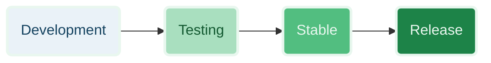
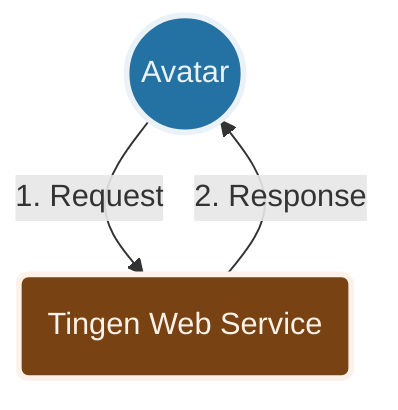

### A note about branches

There are three main branches in the Tingen Web Service repository: 

* **Development**  
The main development branch where new features and updates are actively worked on. Changes in this branch are considered experimental and may not be stable.

* **Testing**  
Once the new features and updates in the Development branch have been tested and are deemed stable, they are merged into the Testing branch for further evaluation before being promoted to the Stable branch.

* **Stable**  
The Stable branch contains the code that is considered stable and ready for release. Changes in this branch are thoroughly tested and vetted before being promoted to the Release branch.

* **Release**  
The Release branch contains the officially released versions of the Tingen Web Service. Changes in this branch are minimal and typically only include critical bug fixes or updates that are necessary for the official release.

There may be other branches that are used for specific features, experiments, or hotfixes. These branches are typically temporary and may be merged into one of the main branches (Development, Testing, Stable, Release) once their purpose has been fulfilled.

## HOW IT WORKS

A very high level overview of how the Tingen Web Service works:

1. Avatar sends an `OptionObject` and a `ScriptParameter` to the Tingen Web Service
2. The Tingen Web Service processes the request and returns a modified `OptionObject` back to Avatar

  

  