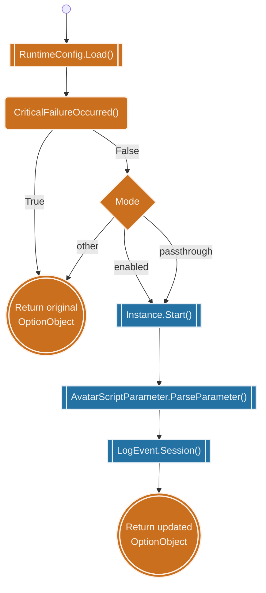
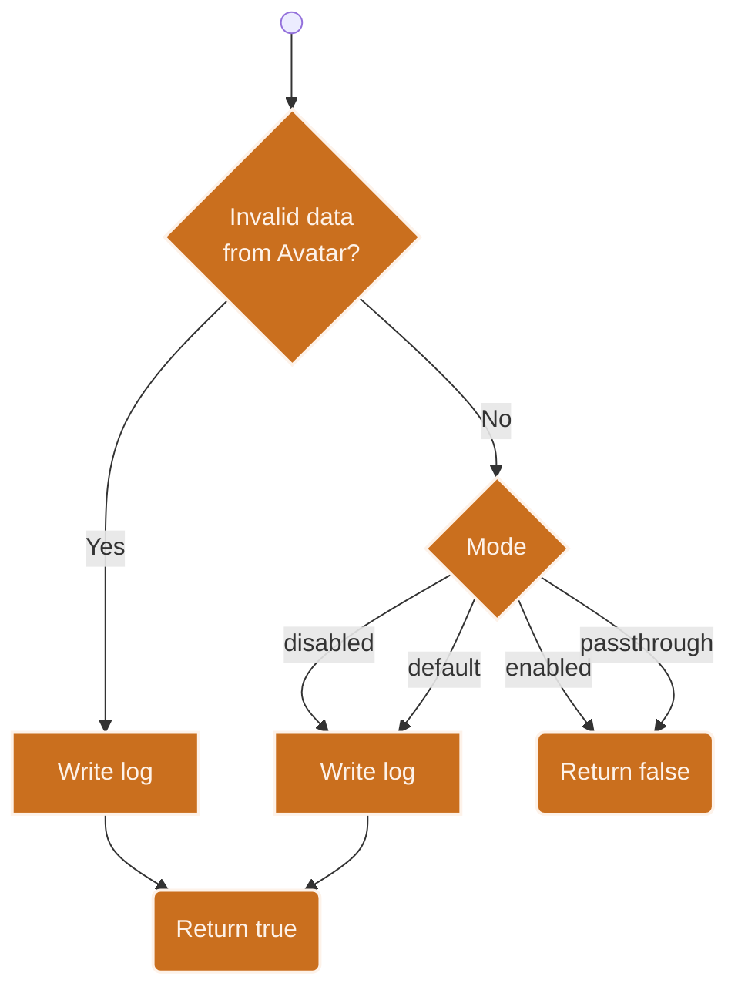
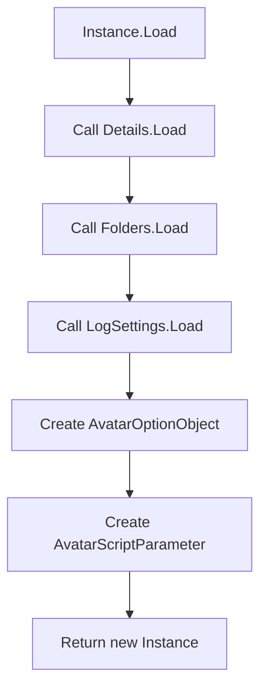
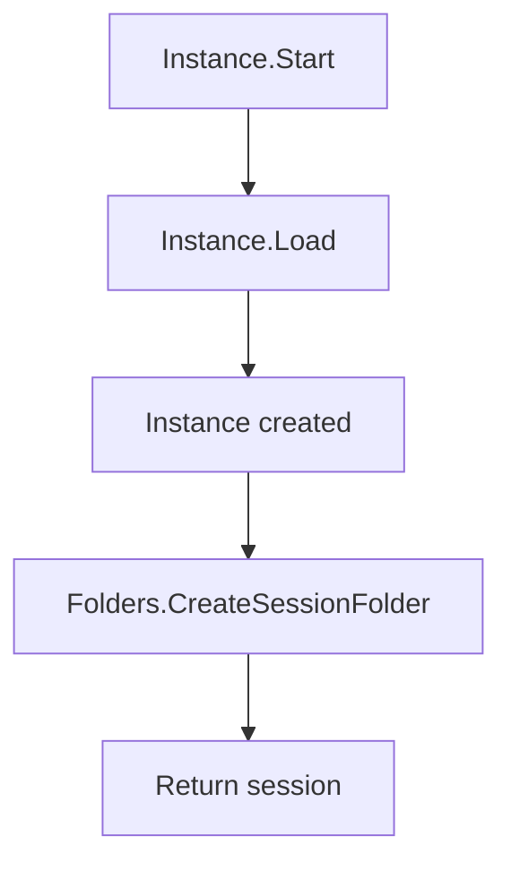
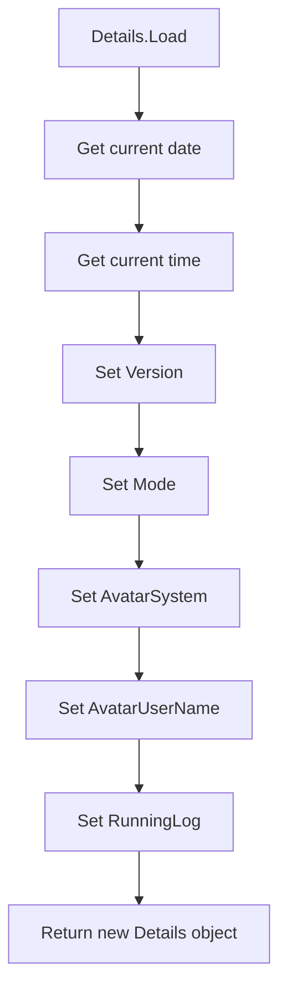
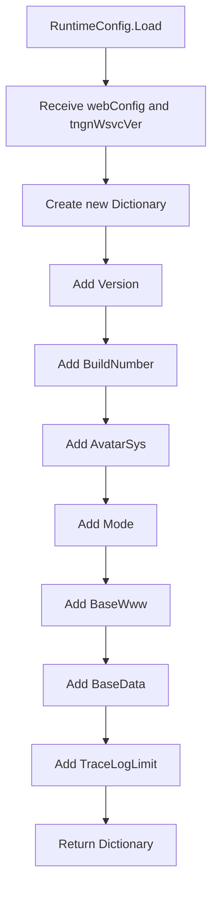

[🏠︎](README.md) ❭ Diagrams

  <picture>
    <source media="(prefers-color-scheme: dark)" srcset="../../../.github/logo/Tingen-WebService-Development-Manual-Logo-Dark-256x256.png">
    <source media="(prefers-color-scheme: light)" srcset="../../../.github/logo/Tingen-WebService-Development-Manual-Logo-Light-256x256.png">
    
  </picture>

  <h1>Diagrams</h1>

---
### CONTENTS

* [TingenWebService](#tingenwebservice) 
  * Core
    * [Avatar](#avatar)
    * [Configuration](#configuration)
    * [Du](#du)
    * [Framework](#framework)
    * [Logger](#logger)
    * [Maintenance](#maintenance)
    * [Operation](#operation)
    * [Parse](#parse)
    * [Query](#query)
    * [TingenWsvcSession](#tingenwsvcsession)
    * [Translation](#translation)
  * Module
    * [DoseChangeEvaluationOtp](#dosechangeevaluationotp)
    * [OpenIncident](#openincident)
    * [TngnWsvc](#tngnwsvc)

---

## TingenWebService

### GetVersion()

Nothing to see here.

### RunScript()

### CriticalFailureOccurred()

## TngnWsvcSession

### Instance.Load()

## Instance.Start()

### Detail.Load()

### Configuration.RuntimeConfig.Load()

 

***

[🏠︎](README.md) ❭ Diagrams

Last updated: 2026-06-01
