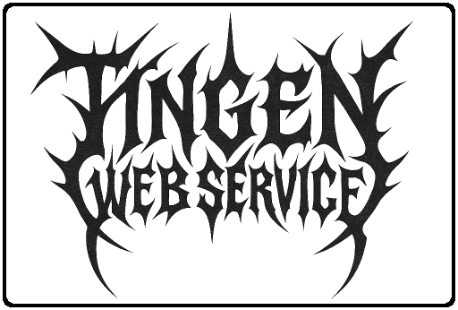
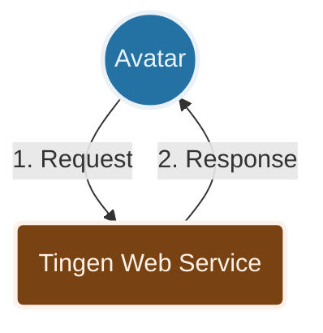

***

> [!WARNING]  
> This is the development release of the Tingen Web Service, and is not intended for use in production environments.

***

  

  <h3>A custom web service for Netsmart's AvatarNX™ EHR platform</h3>

  &nbsp;
  &nbsp; <!-- Alpha = Red, Beta = Yellow, Stable = Green, Development = Orange -->
  &nbsp;
  &nbsp;

***

| CONTENTS                               |
|:-------------------------------------- |
| [About](#about-the-tingen-web-service) |
| [Features](#features)                  |
| [How It Works](#how-it-works)          |
| [Getting Started](#getting-started)    |
| [Built With](#built-with)              |
| [Related Projects](#related-projects)  |
| [License](#license)                    |

***

## ABOUT THE TINGEN WEB SERVICE

Netsmart's [AvatarNX™ EHR](https://www.ntst.com/Solutions-and-Services/Offerings/myAvatar) is a behavioral health Electronic Health Records application that offers a recovery-focused suite of solutions that leverage real-time analytics and clinical decision support to drive value-based care.

While AvatarNX™ is a robust platform, it isn't perfect. The good news is that you can extend AvatarNX™ functionality via Netsmart's Web Services, and/or custom web services that are written by other AvatarNX™ users.

The **Tingen Web Service** is one such custom web service which includes various tools and utilities for AvatarNX™ that aren't included in the official release, and provides a solid foundation for building additional functionality quickly and efficiently.

## FEATURES

* Several built-in tools and utilities that extend the functionality of AvatarNX™
* A solid foundation to build additional AvatarNX™ custom tools and utilities
* Extremely customizable
* Robust logging
* ...and more!

## HOW IT WORKS

A very high level overview of how the Tingen Web Service works:

1. Avatar sends an `OptionObject` and a `ScriptParameter` to the Tingen Web Service
2. The Tingen Web Service processes the request and returns a modified `OptionObject` back to Avatar

## GETTING STARTED

### Requirements

You can find all of the information you need to install and use the Tingen Web Service in the Tingen Web Service [Manual](docs/man/README.md).

## BUILT WITH

* [.NET Framework 4.8](https://dotnet.microsoft.com/en-us/download/dotnet-framework/net48)
* [ScriptLink Standard](https://rcskids.github.io/ScriptLinkStandard/) - A class library for creating SOAP web services [AvatarNX™](https://www.ntst.com/Solutions-and-Services/Offerings/myAvatar)
* [Sandcastle Help File Builder](https://github.com/EWSoftware/SHFB)  - Documentation generation

## RELATED PROJECTS

* [Tingen Transmorger](https://github.com/spectrum-health-systems/Tingen-Transmorger) - Utilities for Netsmart's AvatarNX™ TeleHealth platform

## LICENSE

Distributed under the [Apache 2.0 License](LICENSE)  
Copyright &copy; 2026 [A Pretty Cool Program](https://github.com/APrettyCoolProgram)

***

<h6 align="center">

  [DOCUMENTATION](docs/README.md)&nbsp;&bull;&nbsp;[CHANGELOG](docs/CHANGELOG.md)&nbsp;&bull;&nbsp;[ROADMAP](docs/ROADMAP.md)&nbsp;&bull;&nbsp;[KNOWN ISSUES](docs/KNOWN-ISSUES.md)&nbsp;&bull;&nbsp;[FAQ](docs/FAQ.md)&nbsp;&bull;&nbsp;[SUPPORT](docs/SUPPORT.md)&nbsp;&bull;&nbsp;[NOTICES](docs/NOTICES.md)
  
</h6>
