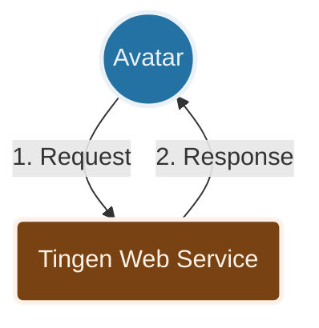

***

> [!WARNING]  
> This is the development release of the Tingen Web Service, and is not intended for use in production environments.

***

  
  
  <h3>A custom web service for Netsmart's AvatarNX™ EHR platform</h3>

  &nbsp;
  &nbsp; <!-- Alpha = Red, Beta = Yellow, Stable = Green, Development = Orange -->
  &nbsp;
  &nbsp;

***

<h6 align="center">

  [DOCUMENTATION](docs/README.md)&nbsp;&bull;&nbsp;[CHANGELOG](docs/CHANGELOG.md)&nbsp;&bull;&nbsp;[ROADMAP](docs/ROADMAP.md)&nbsp;&bull;&nbsp;[KNOWN ISSUES](docs/KNOWN-ISSUES.md)&nbsp;&bull;&nbsp;[FAQ](docs/FAQ.md)&nbsp;&bull;&nbsp;[SUPPORT](docs/SUPPORT.md)&nbsp;&bull;&nbsp;[NOTICES](docs/NOTICES.md)
  
</h6>

***

| CONTENTS                               |
|:-------------------------------------- |
| [About](#about-the-tingen-web-service) |
| [Features](#features)                  |
| [How It Works](#how-it-works)          |
| [Getting Started](#getting-started)    |
| [Built With](#built-with)              |
| [Related Projects](#related-projects)  |
| [License](#license)                    |

***

## ABOUT THE TINGEN WEB SERVICE

Netsmart's [AvatarNX™ EHR](https://www.ntst.com/Solutions-and-Services/Offerings/myAvatar) is a behavioral health Electronic Health Records application that offers a recovery-focused suite of solutions that leverage real-time analytics and clinical decision support to drive value-based care.

While AvatarNX™ is a robust platform, it isn't perfect. The good news is that you can extend AvatarNX™ functionality via Netsmart's Web Services, and/or custom web services that are written by other AvatarNX™ users.

The **Tingen Web Service** is one such custom web service which includes various tools and utilities for AvatarNX™ that aren't included in the official release, and provides a solid foundation for building additional functionality quickly and efficiently.

### A note about branches

There are three main branches in the Tingen Web Service repository: 

* **Development**  
The main development branch where new features and updates are actively worked on. Changes in this branch are considered experimental and may not be stable.

* **Testing**  
Once the new features and updates in the Development branch have been tested and are deemed stable, they are merged into the Testing branch for further evaluation before being promoted to the Stable branch.

* **Stable**  
The Stable branch contains the code that is considered stable and ready for release. Changes in this branch are thoroughly tested and vetted before being promoted to the Release branch.

* **Release**  
The Release branch contains the officially released versions of the Tingen Web Service. Changes in this branch are minimal and typically only include critical bug fixes or updates that are necessary for the official release.

There may be other branches that are used for specific features, experiments, or hotfixes. These branches are typically temporary and may be merged into one of the main branches (Development, Testing, Stable, Release) once their purpose has been fulfilled.

## FEATURES

* Several built-in tools and utilities that extend the functionality of AvatarNX™
* A solid foundation to build additional AvatarNX™ custom tools and utilities
* Extremely customizable
* Robust logging
* ...and more!

## HOW IT WORKS

A very high level overview of how the Tingen Web Service works:

1. Avatar sends an `OptionObject` and a `ScriptParameter` to the Tingen Web Service
2. The Tingen Web Service processes the request and returns a modified `OptionObject` back to Avatar

## GETTING STARTED

### Requirements

You can find all of the information you need to install and use the Tingen Web Service in the [Tingen Web Service Manual](docs/man/README.md).

## BUILT WITH

* [.NET Framework 4.8](https://dotnet.microsoft.com/en-us/download/dotnet-framework/net48)
* [ScriptLink Standard](https://rcskids.github.io/ScriptLinkStandard/) - A class library for creating SOAP web services [AvatarNX™](https://www.ntst.com/Solutions-and-Services/Offerings/myAvatar)
* [Sandcastle Help File Builder](https://github.com/EWSoftware/SHFB)  - Documentation generation

## RELATED PROJECTS

* [Tingen Transmorger](https://github.com/spectrum-health-systems/Tingen-Transmorger) - Utilities for Netsmart's AvatarNX™ TeleHealth platform
* [The Unofficial AvatarNX Runbook](https://github.com/spectrum-health-systems/The-Unofficial-AvartarNX-Runbook) - A collection of tips, tricks, and best practices for working with AvatarNX™

## LICENSE

Distributed under the [Apache 2.0 License](LICENSE)  
Copyright &copy; 2026 [A Pretty Cool Program](https://github.com/APrettyCoolProgram)

***
