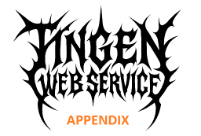

[Appendix](README.md) ❭ Avatar Environment

  <picture>
    <source media="(prefers-color-scheme: dark)" srcset="../../.github/logo/dark/256x173/Appendix.png">
    <source media="(prefers-color-scheme: light)" srcset="../../.github/logo/light/256x173/Appendix.png">
    
  </picture>

  <h1>Avatar Environment</h1>

| CONTENTS |
|:---------|
| [What is an Avatar environment?](#what-is-an-avatar-environment) |
| [Avatar System](#avatar-system) |
| [Avatar System Code](#avatar-system-code) |

***

## What is an Avatar environment?

An **Avatar environment** consists of two components: the Avatar *System* and Avatar *System Code*.

While both contain the word *system*, they are not the same! It is important to understand the difference between the two.

## Avatar System

* The **Avatar System** is the AvatarNX environment that the Tingen Web Service will interface with.

## Avatar System Code

* The **Avatar System Code** is the AvatarNX environment code.

 

***

[Appendix](README.md) ❭ Avatar Environment

Last updated: 260709
