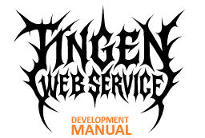
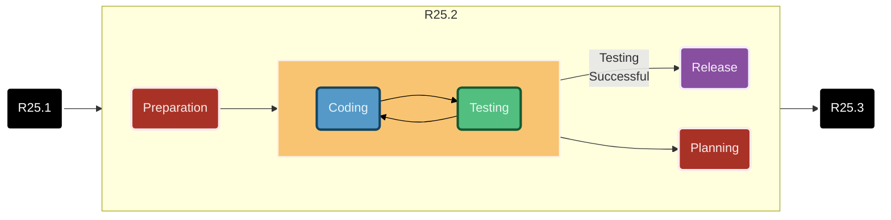
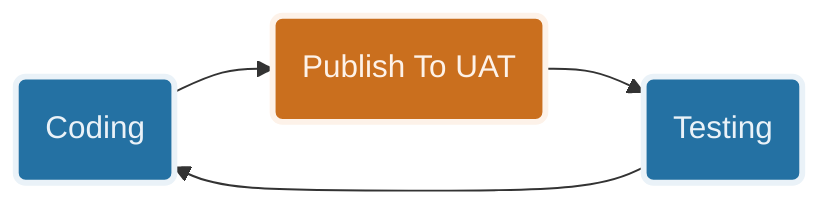
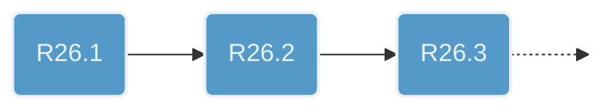

<!--
This documentation is a work in progress.
The goal is to have this completed for R26.7
--->

[Development Manual](README.md) ❭ Stages

<div align="center">

  <picture>
    <source media="(prefers-color-scheme: dark)" srcset="../../.github/logo/dark/256x173/DevMan.png">
    <source media="(prefers-color-scheme: light)" srcset="../../.github/logo/light/256x173/DevMan.png">
    
  </picture>

<h1>Development Stages</h1>

</div>

| CONTENTS |
|:---------|
| [Preparation](#preparation) |
| [Coding/Testing](#codingtesting) |
| [Release](#release) |
| [Planning](#planning) |
| [A word about documentation](#a-word-about-documentation) |

***

<div align="center">

A Nice Looking Chart


</div>

## Preparation

There are a few things we need to do before starting on a new release.

Foe these examples, imagine that is is June 30th, 2026 and we are preparing for the next release, `R26.7`.

### 1. Archive the current release

Create a new repository branch for the current release (e.g., `R26.6`).

### 2. Update the `ProjectInfo.cs` file

Update this line to reflect the new release version (e.g., `R26.7`):

```csharp
// R26.7.0.0-development
```

### 3. Update the `AssemblyInfo.cs` file

Update this line to reflect the new release version (e.g., `R26.7`):

```csharp
[assembly: AssemblyVersion("26.7.0.0")]
[assembly: AssemblyFileVersion("26.7.0.0")]
```

### 4. Update the `BuildNumber` value

**Right-click** the `TingenWebService project` in the Solution Explorer and select **Properties**.

Modify the `BuildNumber` value to reflect the currnet MMYYDD (e.g., `260702`)

### 5. Update Sandcastle profile

Click  **Project Properties** in the Sandcastle project, then choose **Help File".

Modify the "Help file version" to reflect the new release version (e.g., `R26.7`).

### 6. Update repository files

> [!IMPORTANT]
> The following documentation is considered to be "living documentation", and therefore does not display the current release version. These files do not need to be updated:
>
> * Development Manual
> * API documentation
> * Development documentation

Throughout the repository, there will be various files that display the current release version. These files need to be updated to reflect the new release version (e.g., `R26.7`).

This is what the line looks like, and should be changed to:

```markdown

```

> [!NOTE]
>This *should* update all the necessary files, but it is a good idea to do a quick search through the repository to make sure that all instances of the previous release version have been updated.

### 7. Setup CHANGELOG.md and release-notes

Add new entries to the `CHANGELOG.md`, and create a new release notes file (e.g., `R26.7-release-notes.md`) in the `release-notes` folder.

<br/>

***

## Coding/Testing

<div align="center">



</div>

The **Coding** and **Testing** stages smooshed together because they are closely intertwined and often happen in parallel.

For example, when implementing new functionality, testing is done in parallel to ensure the new code works as expected.

Similarly, when fixing bugs, testing is done in parallel to verify that the bug is fixed and that no new issues are introduced.

This stage is where the following takes place:

* Implementing new functionality
* Updating existing functionality
* Fixing issues
* Refactors
* Testing all of the above
* Updating documentation

To [test](NEED-LINK), you'll need to [publish](PublishToUat.md) the current version of the Tingen Web Service to your UAT environment.

<br/>

***

## Release

New versions of the Tingen Web Service are called **Releases**, and follow this pattern:

<div align="center">



</div>

### Versioning

The Tingen Web Service uses the [Semantic Versioning](https://semver.org/) scheme, with the following format:

`MAJOR.MINOR.PATCH+TYPE-BUILD`

* `MAJOR` = The year (e.g., `24`)
* `MINOR` = The month (e.g., `04`)
* `PATCH` = Digit, incremented by 1 (e.g., `1`, `2`, `3`...)
* `TYPE` = The type of release
  * `development`: development versions
  * `stable`: stable versions
  * `rc#`: release candidates
  * `community`: community release
* `BUILD` = Year/Month/Date in `DDHHMM` format (e.g., `081053`)

**Examples:**

* Development release: `24.04.0+development-081053`
* Release candidate: `24.04.0+rc1-081053`
* Stable release: `24.04.0+stable-081053`
* Community release: `24.04.0+community-081053`

In general, releases are made available the last weekday of the release month. For example, `R26.6` will be released on June 30, 2026.

<br/>

***

## Planning

The planning stage is where we determine the scope of the next release. This includes:

* What new functionality will be implemented
* What existing functionality will be updated
* What issues need to be fixed

<br/>

***

## A word about documentation

Documentation is created/updated in parallel with coding.

* **XML documentation**  
More information soon.

* **Project Manual**  
More information soon.

* **API documentation**  
More information soon.

* **Development/miscellaneous documentation**  
More information soon.

<br/>

***

[Development Manual](README.md) ❭ Stages

<sub>Last updated: 260709</sub>
