[The Tingen Web Service Manual](../README.md) ❭ [MDAC](README.md) ❭ Microsoft Internet Information Services (IIS)

<div align="center">

  <picture>
    <source media="(prefers-color-scheme: dark)" srcset="../../../.github/logo/dark/256x173/Man.png">
    <source media="(prefers-color-scheme: light)" srcset="../../../.github/logo/light/256x173/Man.png">
    
  </picture>

  <h1>Internet Information Services</h1>

</div>

| CONTENTS&nbsp;&nbsp;&nbsp;&nbsp;&nbsp;&nbsp;&nbsp;&nbsp;&nbsp;&nbsp;&nbsp;&nbsp;&nbsp;&nbsp;&nbsp;&nbsp;&nbsp;&nbsp;&nbsp;&nbsp;&nbsp;&nbsp; |
|:---------------------------------------------------------------------------------------------------------------------------------------------|
| [Overview](#overview)                                 |
| [Installing Microsoft IIS](#installing-microsoft-iis) |
| [Setup IIS](#setup-iis)                               |

***

## Overview

In order to use any web service that interfaces with myAvatar™, that web service needs to be ***hosted*** at a location that myAvatar™ has access to.

There are two options for hosting a custom web service:

1. **Have Netsmart host your custom web service**<br>
If your myAvatar™ environments are hosted by Netsmart, they can also host your custom web services. If you choose to have Netsmart host your custom web service, you can skip the rest of this document and contact them to set things up.

2. **Self-host your custom web service**<br>
If you self-host your myAvatar™ environments, or would rather have complete control over your custom web services, you can self-host them.

This document will walk you through the process of:

* Installing Microsoft IIS
* Setting up Microsoft IIS to host the Tingen Web Service

## Installing Microsoft IIS

This is what we are going to be doing:

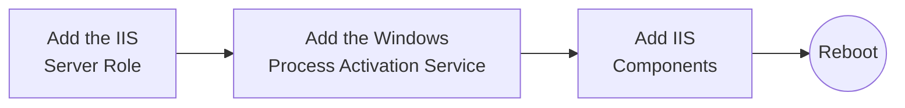

1. Launch the **Server Manager** application
2. Under **Server Roles**, check the box next to **Web Server (IIS)**

<div align="center">

  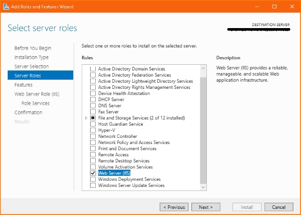

</div>

3. If a popup suggests you include the *IIS Mangement Console* tools, checked, then click ***Add Features***

<div align="center">

  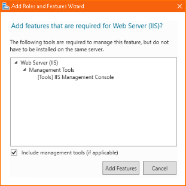

</div>

4. Under **Features**, add the **Windows Process Activation Service**

<div align="center">

  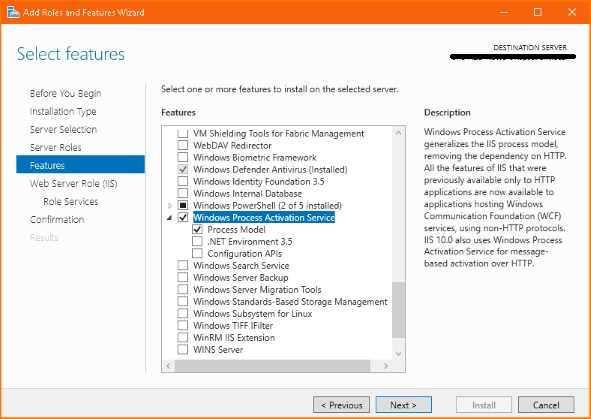

</div>

5. Under **Web Server Role (IIS) > Role Services**, verify that the components highlighted green are set properly

<div align="center">

  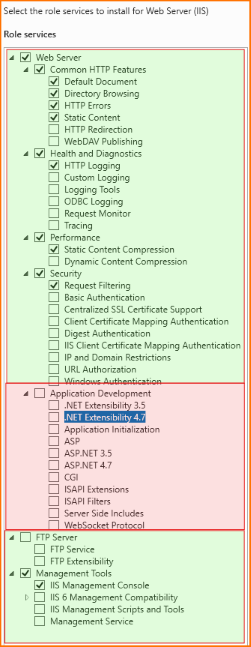

</div>

6. Under **Web Server Role (IIS) > Role Services**, check **Application Development**

<div align="center">

  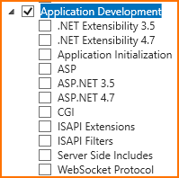

</div>

7. In the **Application Development** section, check the following *in this order*:

* **ISAPI Filters**
* **ISAPI Extensions**
* **.NET Extensibility 4.7**
* **ASP.NET 4.7**

<div align="center">

  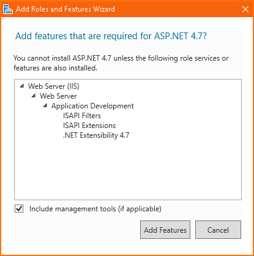

</div>

> [!NOTE]
> If you didn't follow the order above, you may get a popup letting you know that required features are missing. Just click ***Add Features***, and continue.

8. Click ***Next***, and you should see the confirmation screen:

<div align="center">

  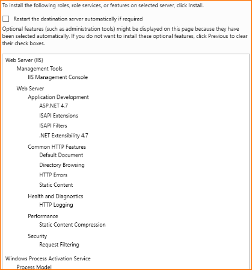

</div>

9. Click ***Install***
10. Once the installation is complete, click ***Close***

### Reboot

If you checked the *Restart the destination server automatically if required* box on the confirmation screen, the server should reboot automatically.

If the server does not reboot automatically, reboot manually.

## Setup IIS

Now that IIS is installed, we need to set it up to host the Tingen Web Service.

This is what we are going to be doing:


This is what a fresh installation of IIS should look like:

<div align="center">

  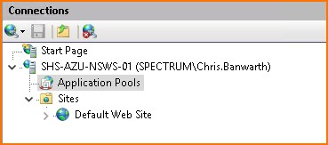

</div>

### Disable the current Application Pools

Since we are going to be creating a new Application Pool, we can disable those that were installed with IIS.

<div align="center">

  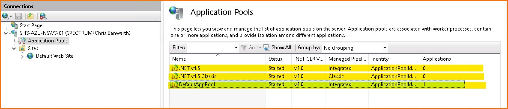

</div>

To do this, **right click** on the following Application Pools (hightlighted yellow), then choose **Stop**

* .NET v4.5
* .NET v4.5 Classic
* DefaultAppPool

The Application Pools should now look like this:

<div align="center">

  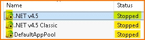

</div>

### Create a new Application Pool

From within IIS:

1. Right-click the **Application Pools** connection
2. Choose **Add Application Pool…**
3. Name the Application Pool `Tingen_WebService`
4. Verify everything looks like this:

<div align="center">

  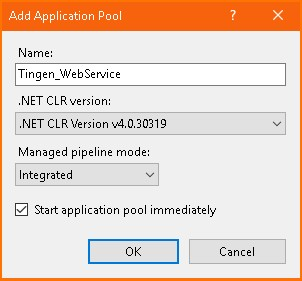

</div>

5. Click ***OK***
6. Verify that the new Application Pool is listed, and has started:

<div align="center">

  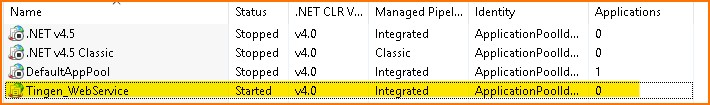

</div>

### Disable the current site

Since we are going to be creating a new Site, we can disable default site that was installed with IIS.

<div align="center">

  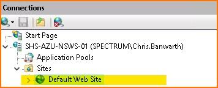

</div>

To do this:

1. **Right click** on the *`Default Web Site* (hightlighted yellow)
2. Choose **Manage Website**
3. Choose **Stop**

The Default Web Site should now look like this:

<div align="center">

  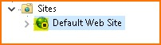

</div>

### Create a new site

From within IIS:
1. Right-click the **Sites** connection
2. Choose **Add Website**
3. The **Site name** should be: *AvatoolWebService*
4. The **Application pool** should be: *AvatoolWebService*
5. The **Physical path** should be: */path/to/your/files/*
6. In the **Binding > Type** dropdown, choose ***https***
7. Click the **Select...** button, and choose a valid certificate to use

This is what the Add Website window should look like:

<div align="center">

  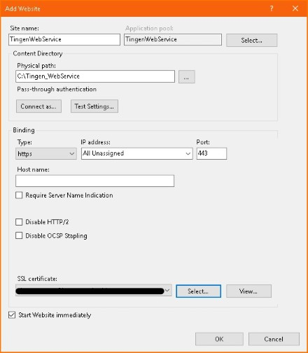

</div>

8. Click **OK**, and the ***Sites*** tree should look like this:

<div align="center">

  

</div>

### Configure the new site

We'll want to make sure that we are in the TingenWebService site when configuring:

<div align="center">

  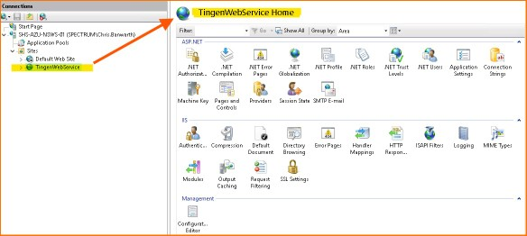

</div>

### Enable SSL

In the TingenWebService Home:

1. Double-click on the **SSL Settings** icon:

<div align="center">

  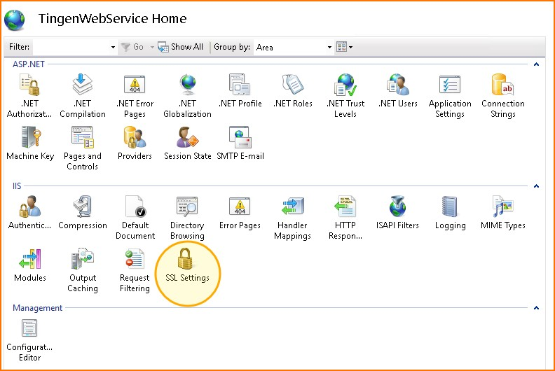

</div>

2. Check the **Require SSL** box
3. On the right-hand side under **Actions**, click **Apply**

<div align="center">

  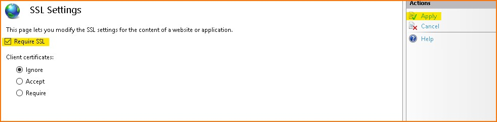

</div>

The SSL Settings should now look like this:

<div align="center">

  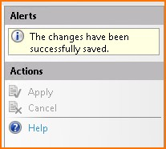

</div>

### Verify the TingenWebService Site is secure

In the TingenWebService Home, click on **Browse *:433 (https)**.

<div align="center">

  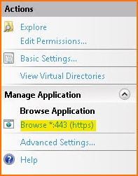

</div>

The following page should open in a browser:

<div align="center">

  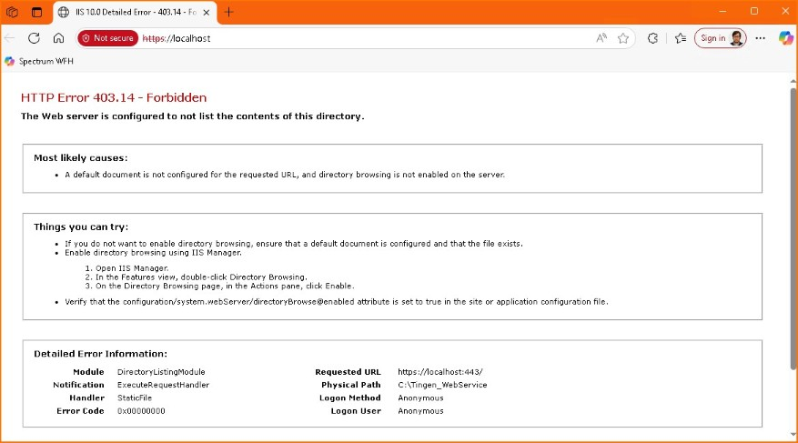

</div>

### Create the `Tingen_WebService\LIVE` folder

Add a folder for `LIVE` to the `C:\Tingen_WebService` folder, like this:

<div align="center">

  

</div>

### Create a test web page

1. Create a file named `test-page.html` with the following content:

```text
Hello World!
```

2. Save that file to `C:\Tingen_WebService\LIVE`

### Convert `TingenWebService\LIVE` to an Application

In IIS, folders look like...uh...folders, and Applications look like the symbol next to `UAT`

<div align="center">

  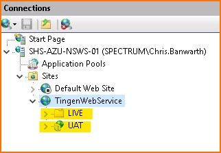

</div>

`UAT` looks like that because I've already converted it to an Application, which is what we are going to do with `LIVE` now.

1. **Right-click** on `LIVE` under ***Sites > TingenWebService***
2. Choose **Convert to Application**

The ***Add Application*** window should look like this:

<div align="center">

  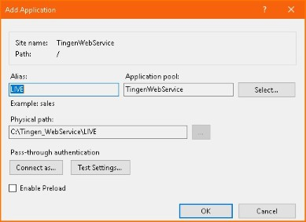

</div>

3. Click **OK**

### Enable directory Browsing

> [!TIP]  
> If the web service stops working, this is one of the first things to check!

In the `/LIVE` Home:

1. Double-click on the **Directory Browsing** icon:

<div align="center">

  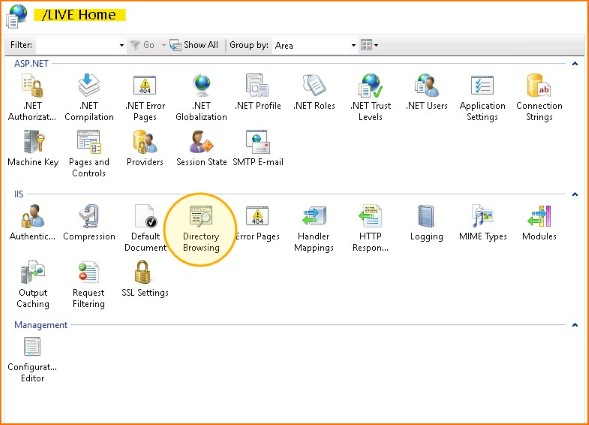

</div>

On the right-hand side under **Actions**, click **Enable**

<div align="center">

  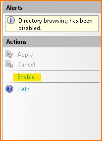

</div>

2. Click **Enable**

The browsing functionality should now look like this:

<div align="center">

  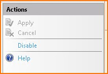

</div>

### Modify access to the `Tingen_WebService` folder

Give the following users access to the `C:\Tingen_WebService` folder:

* `IIS AppPool\Tingen_WebService`
* `%ServerName%\IIS_IUSRS`

### Modify the Anonymous Authentication settings

1. Click the **Tingen_WebServices** Site

2. Click the **Authentication** icon

3. **Right-click** the ***Anonymous Authentication*** option

4. Change the ***User Identity*** to **Application Pool**

### Test the `LIVE` application

In the /LIVE Home, click the **Browse *:443 (https)** link

The following page should open in a browser:

<div align="center">

  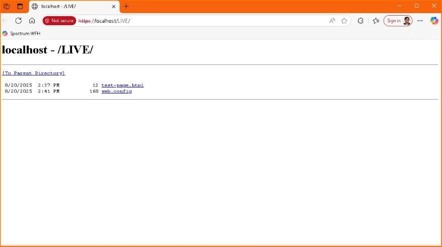

</div>

Clicking on **test-page.html** should display this page:

<div align="center">

  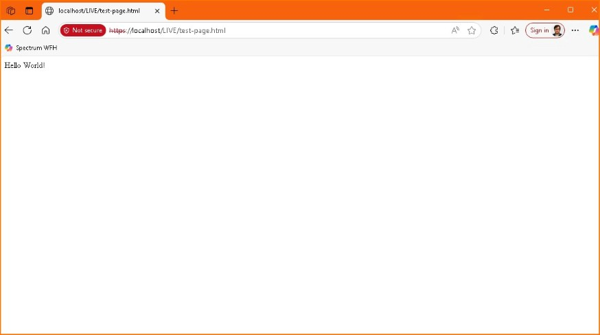

</div>

<br/>

***

[The Tingen Web Service Manual](../README.md) ❭ [MDAC](README.md) ❭ Microsoft Internet Information Services (IIS)

<sub>Last updated: 260610</sub>
