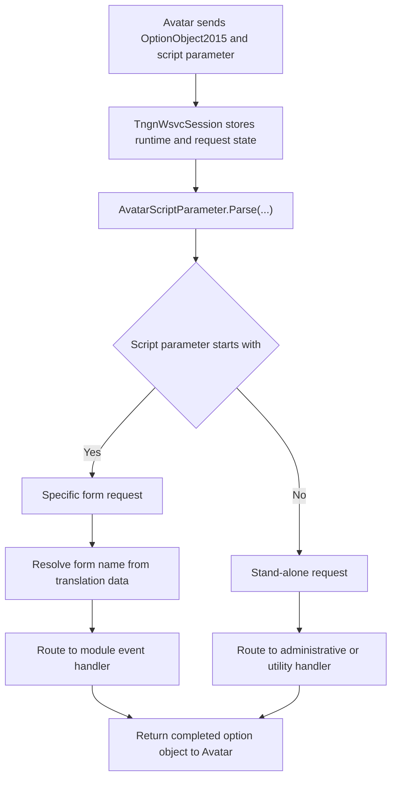

[Source Code Documentation](README.md)  ns:TingenWebService.Core.Avatar

  <picture>
    <source media="(prefers-color-scheme: dark)" srcset="../../.github/logo/dark/256x173/SrcDoc.png">
    <source media="(prefers-color-scheme: light)" srcset="../../.github/logo/light/256x173/SrcDoc.png">
    
  </picture>

  <h1>ns:TingenWebService.Core.Avatar</h1>

***

> [!NOTE]
> See the [API documentation](https://spectrum-health-systems.github.io/Tingen-WebService/api/html/26dce61d-32bf-a493-7f2a-d9e2fa38be90.htm) for the source-level reference for this namespace.

***

## Overview

The `TingenWebService.Core.Avatar` namespace contains the core types that model Avatar-specific session data and support Avatar request processing.

These types preserve the original request payload, describe the current Avatar environment, and interpret the script parameter sent by Avatar at runtime.

## Types in this namespace

| Type | Purpose |
|---|---|
| `AvatarEnvironment` | Represents the Avatar system and system code used by the current session. |
| `AvatarOptionObject` | Stores the original, working, and completed Avatar `OptionObject2015` instances used during processing. |
| `AvatarScriptParameter` | Stores and routes the original script parameter supplied by Avatar. |
| `NamespaceDoc` | Documentation-only type used to describe the namespace in generated help output. |

## Key responsibilities

### `AvatarEnvironment`

`AvatarEnvironment` describes the Avatar context for a session.

It separates two related values:

- **Avatar System**: the environment the service will connect to
- **Avatar System Code**: the code used to identify that environment

This distinction matters when the service must target the correct AvatarNX environment.

### `AvatarOptionObject`

`AvatarOptionObject` manages the request payload returned by Avatar.

It keeps three versions of the option object:

- **Original**: the unmodified object received from Avatar
- **Worker**: the mutable working copy used during processing
- **Completed**: the final object returned to Avatar

This structure preserves the inbound request while still allowing safe transformation during processing.

### `AvatarScriptParameter`

`AvatarScriptParameter` manages the script parameter sent by Avatar and routes the request to the correct handler.

It supports two main request styles:

- **Specific form requests**: script parameters that begin with `_`
- **Stand-alone requests**: script parameters that do not begin with `_`

The class also resolves form names from translation data and dispatches requests to the appropriate module, such as `OpenIncident` or `DoseChangeEvaluationOtp`.

## Request flow

## How the namespace is used

A typical request flow is:

1. Avatar sends an `OptionObject2015` and a script parameter.
2. `TngnWsvcSession` stores the Avatar payload and runtime state.
3. `AvatarScriptParameter.Parse(...)` determines how the request should be routed.
4. `AvatarEnvironment` and `AvatarOptionObject` provide the Avatar-specific context needed by downstream processing.
5. The selected module performs its work and returns the completed option object.

## Related namespaces

- `TingenWebService.Core.TingenWsvcSession` — session state and bootstrap logic
- `TingenWebService.Core.Framework` — folder and runtime framework support
- `TingenWebService.Core.Translation` — translation file helpers for Avatar identifiers
- `TingenWebService.Module.OpenIncident` — OpenIncident module processing
- `TingenWebService.Module.DoseChangeEvaluationOtp` — Dose Change Evaluation OTP processing

 

***

[Source Code Documentation](README.md) ❭ ns:TingenWebService.Core.Avatar

Last updated: 260709
