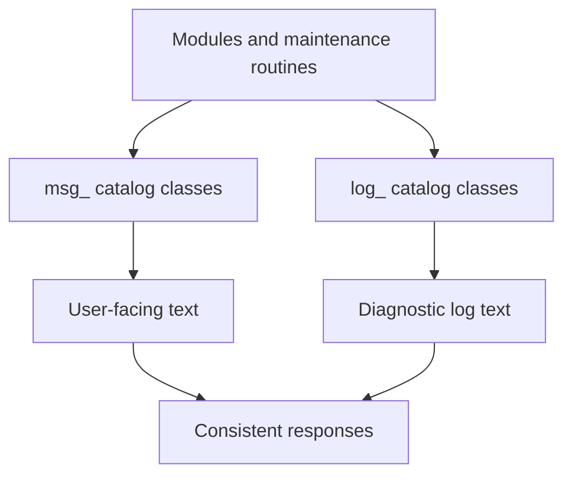

[Source Code Documentation](README.md) ❭ ns:TingenWebService.Core.Catalog

  <picture>
    <source media="(prefers-color-scheme: dark)" srcset="../../../.github/logo/dark/256x173/SrcDoc.png">
    <source media="(prefers-color-scheme: light)" srcset="../../../.github/logo/light/256x173/SrcDoc.png">
    
  </picture>

  <h1>ns:TingenWebService.Core.Catalog</h1>

***

> [!NOTE]
> See the API documentation for the source-level reference for this namespace.

***

## Overview

The `TingenWebService.Core.Catalog` namespace contains message catalog helpers used throughout the Tingen Web Service.

These types centralize the text used for logs, user-facing messages, and other formatted output so that related code paths stay consistent and easy to maintain.

The namespace is intentionally small and focused: each class returns predefined text for a specific area of the application, such as framework behavior, maintenance tasks, or module validation.

## Types in this namespace

| Type | Purpose |
|---|---|
| `log_DoseChangeEval` | Builds structured log content for the Dose Change Evaluation OTP module. |
| `msg_Framework` | Builds user-facing messages for framework-related events. |
| `msg_Maintenance` | Builds user-facing messages for translation and blueprint maintenance tasks. |
| `msg_TngnWscv` | Builds general Tingen Web Service log/status messages. |
| `NamespaceDoc` | Documentation-only type used to describe the namespace in generated help output. |

## Message categories

The namespace uses a simple naming convention:

- `log_` classes build log-oriented content
- `msg_` classes build user-facing or informational text

This separation makes it easier to identify whether a catalog method is intended for diagnostic logging or for display to a user.

## Key responsibilities

### `msg_TngnWscv`

`msg_TngnWscv` provides general service-level messages, including:

- missing request components
- disabled service mode
- unknown service mode

These messages are used when the service must explain a high-level runtime condition.

### `msg_Framework`

`msg_Framework` provides framework-related messages.

It currently focuses on folder creation feedback so the service can report when supporting directories are created during runtime.

### `msg_Maintenance`

`msg_Maintenance` provides maintenance-related messages.

It is used when the service refreshes supporting assets such as:

- translation tables
- blueprint files

The returned text clearly indicates whether the refresh operation has started or completed.

### `log_DoseChangeEval`

`log_DoseChangeEval` builds structured log lines for the Dose Change Evaluation OTP module.

Its output is designed to support troubleshooting by capturing the caller information, the query or diagnostic text, and the physician/approver value involved in the decision.

## How the namespace is used

A typical catalog flow is:

1. A module or maintenance routine determines that a message is needed.
2. The appropriate catalog helper builds the text.
3. The returned text is written to a log file or returned to Avatar.
4. The caller does not need to duplicate message wording or formatting.

## Related namespaces

- `TingenWebService.Core.Framework` — folder and runtime framework support
- `TingenWebService.Core.Logger` — shared logging infrastructure
- `TingenWebService.Core.Maintenance` — daily and session maintenance routines
- `TingenWebService.Module.OpenIncident` — OpenIncident workflow processing
- `TingenWebService.Module.DoseChangeEvaluationOtp` — Dose Change Evaluation OTP processing

 

***

[Source Code Documentation](README.md)  ❭ ns:TingenWebService.Core.Catalog

Last updated: 260709
