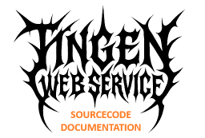
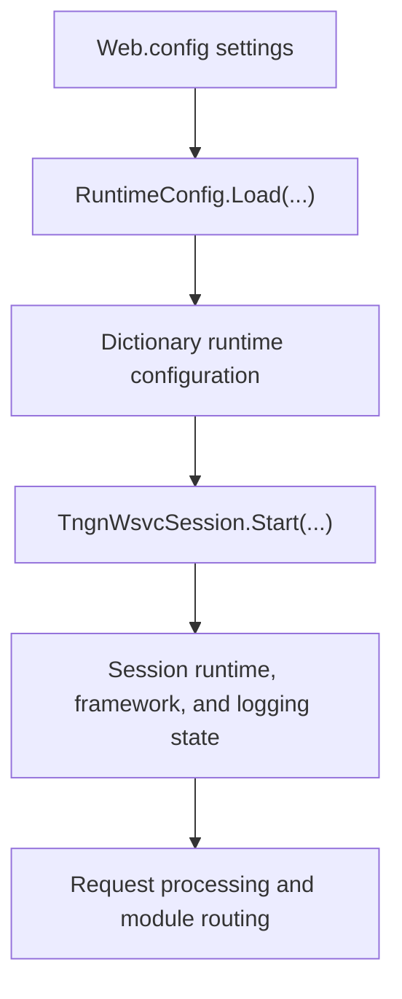

[Source Code Documentation](README.md) ❭ ns:TingenWebService.Core.Configuration

  <picture>
    <source media="(prefers-color-scheme: dark)" srcset="../../../.github/logo/dark/256x173/SrcDoc.png">
    <source media="(prefers-color-scheme: light)" srcset="../../../.github/logo/light/256x173/SrcDoc.png">
    
  </picture>

  <h1>ns:TingenWebService.Core.Configuration</h1>

***

> [!NOTE]
> See the [API documentation](https://spectrum-health-systems.github.io/Tingen-WebService/api/html/be892e39-aa9d-26b9-cfa6-98ab747188cc.htm) for the source-level reference for this namespace.

***

## Overview

The `TingenWebService.Core.Configuration` namespace contains the types that load and expose runtime configuration for the Tingen Web Service.

These values are read from `Web.config`, normalized into a lookup structure, and passed into the session bootstrap process so the service can operate with the correct environment, paths, credentials, and logging limits.

## Types in this namespace

| Type | Purpose |
|---|---|
| `RuntimeConfig` | Loads runtime configuration values from strongly typed `Web.config` settings and returns them as a dictionary. |
| `NamespaceDoc` | Documentation-only type used to describe the namespace in generated help output. |

## Key responsibilities

### `RuntimeConfig`

`RuntimeConfig` is responsible for collecting the core runtime settings used by the service.

The `Load(...)` method converts the application settings into a `Dictionary<string, string>` containing values such as:

- version
- build number
- Avatar system
- operating mode
- server paths
- trace and session log limits
- Netsmart service credentials

This approach keeps configuration access centralized and makes the values easy to pass into session initialization.

## Configuration flow

## How the namespace is used

A typical configuration flow is:

1. `Web.config` stores the application settings.
2. `RuntimeConfig.Load(...)` reads and normalizes those settings.
3. `TngnWsvcSession.Start(...)` receives the runtime configuration dictionary.
4. The session uses those values to build the runtime, framework, and logging state required for request processing.

## Why this namespace matters

The namespace keeps configuration handling in one place.

That makes it easier to:

- add or update a setting
- keep runtime values consistent across the application
- avoid hard-coding environment-specific values in request logic
- support maintenance and deployment across different Avatar environments

## Related namespaces

- `TingenWebService.Core.TingenWsvcSession` — session state and bootstrap logic
- `TingenWebService.Core.Framework` — folder and runtime framework support
- `TingenWebService.Core.Logger` — shared logging infrastructure

 

***

[Source Code Documentation](README.md) ❭ ns:TingenWebService.Core.Configuration

Last updated: 260709
