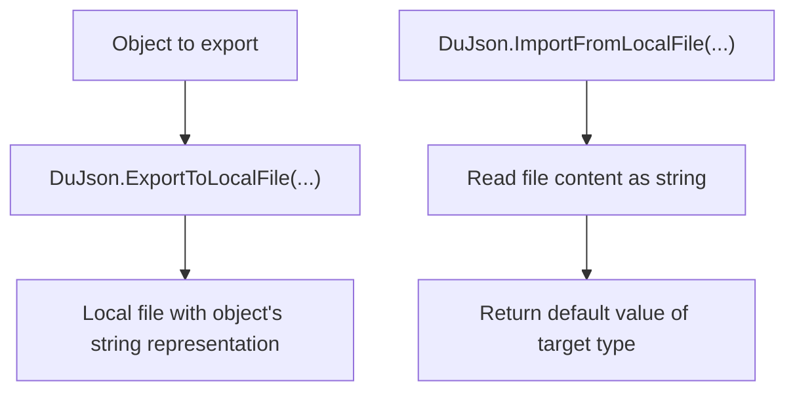

[Source Code Documentation](README.md) ❭ ns:TingenWebService.Core.Du

  <picture>
    <source media="(prefers-color-scheme: dark)" srcset="../../../.github/logo/dark/256x173/SrcDoc.png">
    <source media="(prefers-color-scheme: light)" srcset="../../../.github/logo/light/256x173/SrcDoc.png">
    
  </picture>

  <h1>ns:TingenWebService.Core.Du</h1>

***

> [!NOTE]
> See the [API documentation](https://spectrum-health-systems.github.io/Tingen-WebService/api/html/2f5e2b34-0e5f-4a1f-9f0f-7d9d4f8b6c4a.htm) for the source-level reference for this namespace.

***

## Overview

The `TingenWebService.Core.Du` namespace contains low-level data utility helpers used by the Tingen Web Service.

Its primary purpose is to support simple local file operations, especially JSON-oriented import and export tasks that are shared by module configuration classes and other internal components.

The namespace is intentionally small and focused so file handling stays centralized and consistent.

## Types in this namespace

| Type | Purpose |
|---|---|
| `DuJson` | Provides helper methods for writing objects to local JSON files and reading JSON-like file content back from disk. |
| `NamespaceDoc` | Documentation-only type used to describe the namespace in generated help output. |

## Key responsibilities

### `DuJson`

`DuJson` provides two utility methods:

- `ExportToLocalFile(...)` writes an object to a local file.
- `ImportFromLocalFile(...)` reads a local file and returns the target type's default value.

The export method is used by configuration classes to persist default or updated settings to disk.  
The import method is used by configuration classes to load those settings back into memory.

### JSON handling note

Because the project targets `.NET Framework 4.8`, the implementation does not rely on `System.Text.Json`.

Instead, the current export routine writes the object's string representation directly to disk.  
This keeps the dependency surface small, but it also means the output format depends on the object's `ToString()` implementation.

## Data utility flow

## How the namespace is used

A typical use of this namespace is:

1. A module creates or updates a configuration object.
2. `DuJson.ExportToLocalFile(...)` writes the object to disk.
3. Later, `DuJson.ImportFromLocalFile(...)` is used to reload the file.
4. Higher-level code uses the loaded object to drive runtime behavior.

## Related namespaces

- `TingenWebService.Core.Configuration` — loads runtime configuration values from `Web.config`
- `TingenWebService.Module.OpenIncident` — module configuration loading and persistence
- `TingenWebService.Module.DoseChangeEvaluationOtp` — module configuration loading and persistence

 

***

[Source Code Documentation](README.md) ❭ ns:TingenWebService.Core.Du

Last updated: 260709
