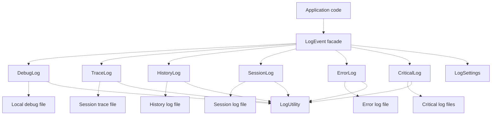

[Source Code Documentation](README.md) ❭ ns:TingenWebService.Core.Logger

  <picture>
    <source media="(prefers-color-scheme: dark)" srcset="../../../.github/logo/dark/256x173/SrcDoc.png">
    <source media="(prefers-color-scheme: light)" srcset="../../../.github/logo/light/256x173/SrcDoc.png">
    
  </picture>

  <h1>ns:TingenWebService.Core.Logger</h1>

***

> [!NOTE]
> See the [API documentation](https://spectrum-health-systems.github.io/Tingen-WebService/api/html/c39fb7b4-dd7b-71c3-7ea0-64a93d9fd8fa.htm) for the source-level reference for this namespace.

***

## Overview

The `TingenWebService.Core.Logger` namespace contains the logging infrastructure used throughout the Tingen Web Service.

It provides a consistent way to write debug, trace, history, session, error, and critical log entries, while also supplying the shared configuration and file/path helpers that those log writers depend on.

This namespace is central to troubleshooting because it captures both the runtime context and the caller information needed to reproduce request flow and diagnose failures.

## Types in this namespace

| Type | Purpose |
|---|---|
| `CriticalLog` | Creates critical error log files for the current session and shared log folder. |
| `DebugLog` | Writes development debug log files. |
| `ErrorLog` | Creates error log files. |
| `HistoryLog` | Writes history log entries. |
| `LogComponents` | Provides reusable pieces used to compose log entries. |
| `LogEvent` | Provides a unified facade for raising log events of different severities and types. |
| `LogSettings` | Stores the logging configuration values used by the Tingen Web Service. |
| `LogUtility` | Provides shared file and path helpers used by the logging components. |
| `SessionLog` | Builds and writes session log files. |
| `TraceLog` | Writes trace log files for the current session. |
| `NamespaceDoc` | Documentation-only type used to describe the namespace in generated help output. |

## Key responsibilities

### `LogEvent`

`LogEvent` is the primary entry point for most logging calls.

Rather than requiring callers to know which helper class to use, it exposes a single facade for common log types:

- `Debug(...)`
- `Trace(...)`
- `History(...)`
- `Session(...)`
- `Error(...)`
- `Critical(...)`

This keeps calling code simpler and ensures that logging behavior remains consistent across the application.

### `LogSettings`

`LogSettings` stores the log-related limits used during processing.

Its values control:

- trace output volume
- session log retention
- other log timing or throttling behavior

The namespace uses these settings to decide how much information should be written and when.

### `LogUtility`

`LogUtility` provides shared file and path helpers.

It centralizes common operations such as:

- extracting class names from file paths
- writing text to a local file
- appending text to a local file

This avoids duplicate file-handling logic in the individual log writers.

### Specialized log writers

The remaining log types focus on a specific log stream:

- `DebugLog` for development-only debug output
- `TraceLog` for session tracing
- `HistoryLog` for historical session activity
- `SessionLog` for per-session summaries
- `ErrorLog` for recoverable errors
- `CriticalLog` for unrecoverable failures

Each type focuses on one responsibility and keeps its formatting rules in one place.

<!-- Needs to be fixed

## Logging flow

-->

## How the namespace is used

A typical logging flow is:

1. Runtime or module code decides that a log entry is needed.
2. `LogEvent` selects the correct log writer.
3. The writer builds the message or file name.
4. `LogUtility` performs the file operation.
5. The resulting log file is stored in the appropriate session or shared folder.

## Why this namespace matters

The logging namespace keeps diagnostic behavior centralized.

That helps the service:

- write consistent log messages
- preserve caller context
- keep logging file operations in one place
- support troubleshooting across sessions and modules

## Related namespaces

- `TingenWebService.Core.Framework` — session folder and runtime path support
- `TingenWebService.Core.TingenWsvcSession` — session state and bootstrap logic
- `TingenWebService.Module.OpenIncident` — module processing that writes session logs
- `TingenWebService.Module.DoseChangeEvaluationOtp` — module processing that writes session logs

 

***

[Source Code Documentation](README.md) ❭ ns:TingenWebService.Core.Logger

Last updated: 260709
