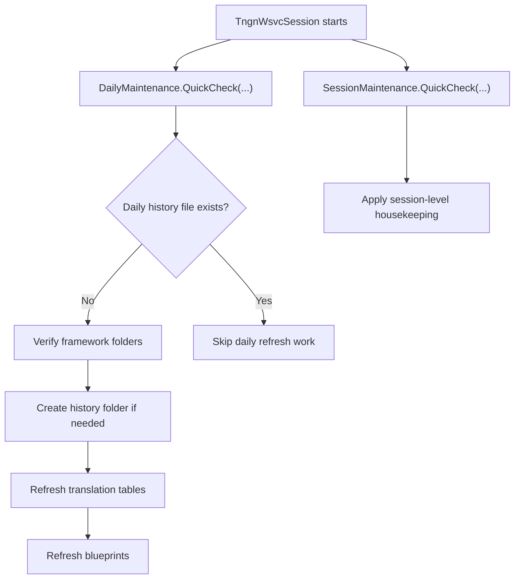

[Source Code Documentation](README.md) ❭ ns:TingenWebService.Core.Maintenance

  <picture>
    <source media="(prefers-color-scheme: dark)" srcset="../../../.github/logo/dark/256x173/SrcDoc.png">
    <source media="(prefers-color-scheme: light)" srcset="../../../.github/logo/light/256x173/SrcDoc.png">
    
  </picture>

  <h1>TingenWebService.Core.Maintenance namespace</h1>

***

> [!NOTE]
> See the API documentation for the source-level reference for this namespace.

***

## Overview

The `TingenWebService.Core.Maintenance` namespace contains the maintenance routines that keep the Tingen Web Service in a valid, ready-to-run state.

It handles both daily and session-scoped housekeeping. That includes verifying the framework folder structure, creating missing support folders, refreshing translation tables, and copying updated blueprint files into the working data area.

## Types in this namespace

| Type | Purpose |
|---|---|
| `DailyMaintenance` | Performs daily verification and refresh tasks for framework data, translation tables, and blueprints. |
| `SessionMaintenance` | Provides per-session housekeeping operations for the active session folder. |
| `NamespaceDoc` | Documentation-only type used to describe the namespace in generated help output. |

## Key responsibilities

### `DailyMaintenance`

`DailyMaintenance` contains the main maintenance workflow used by the service.

Its responsibilities include:

- checking whether daily maintenance has already run for the current session date
- verifying the framework folder structure
- creating missing history and log folders
- refreshing translation tables from generated Avatar data
- refreshing blueprint files from the source `www` folder

The class is driven by the current `TngnWsvcSession`, so it can use the active runtime, framework, and logging settings without requiring extra global state.

### `SessionMaintenance`

`SessionMaintenance` is the per-session counterpart to `DailyMaintenance`.

It is intended for lightweight housekeeping that should run once per session or during the request pipeline rather than once per day.

The current implementation is a stub, but its purpose is clear:

- enforce trace log retention limits in the active session folder
- provide a session-level maintenance hook for the framework
- support future porting of the original session-maintenance behavior

## Maintenance flow

## How the namespace is used

A typical maintenance pass works like this:

1. The service starts or processes a request using `TngnWsvcSession`.
2. `DailyMaintenance.QuickCheck(...)` determines whether the day's maintenance has already been completed.
3. If needed, `DailyMaintenance.VerifyTingenWebService(...)` validates the framework and refreshes supporting data.
4. `SessionMaintenance.QuickCheck(...)` provides the session-level hook for per-session cleanup or retention checks.
5. Logging and history entries record the work performed.

## Why this namespace matters

This namespace keeps the service consistent between sessions and across days.

It helps the application:

- verify required folders before processing begins
- keep generated translation data current
- keep blueprint files synchronized with their source location
- preserve operational history for diagnostics and support

## Related namespaces

- `TingenWebService.Core.Framework` — folder verification and runtime path support
- `TingenWebService.Core.Logger` — trace, history, and diagnostic logging
- `TingenWebService.Core.Query` — translation file generation support
- `TingenWebService.Core.TingenWsvcSession` — runtime state and session bootstrap
- `TingenWebService.Core.Translation` — translation helpers used during refresh operations

 

***

[Source Code Documentation](README.md) ❭ ns:TingenWebService.Core.Maintenance

Last updated: 260709
