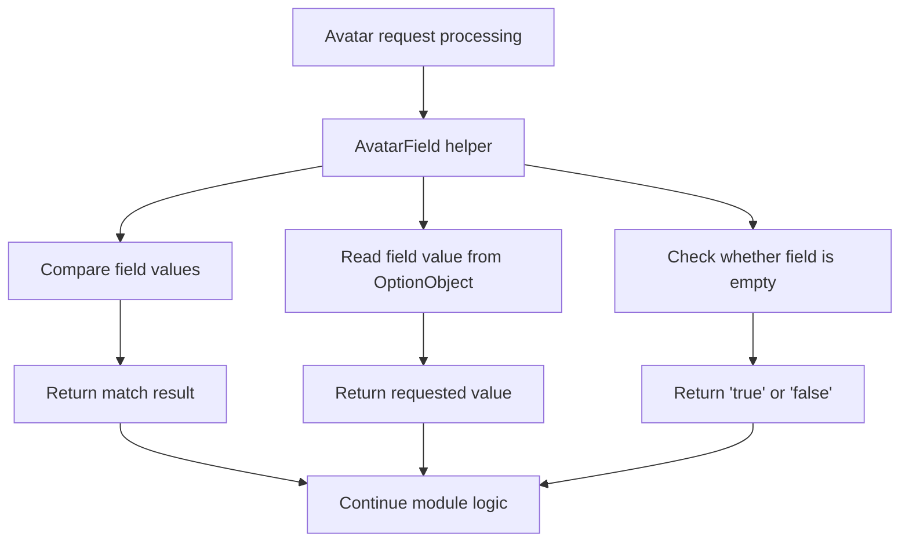

[Source Code Documentation](README.md) ❭ ns:TingenWebService.Core.Operation

  <picture>
    <source media="(prefers-color-scheme: dark)" srcset="../../../.github/logo/dark/256x173/SrcDoc.png">
    <source media="(prefers-color-scheme: light)" srcset="../../../.github/logo/light/256x173/SrcDoc.png">
    
  </picture>

  <h1>ns:TingenWebService.Core.Operation</h1>

***

> [!NOTE]
> See the API documentation for the source-level reference for this namespace.

***

## Overview

The `TingenWebService.Core.Operation` namespace contains small, focused helpers for working with Avatar field values.

These helpers centralize common field operations such as equality checks, value retrieval, and empty-value detection. That keeps calling code simple and ensures field-level logic follows the same comparison and logging behavior throughout the service.

## Types in this namespace

| Type | Purpose |
|---|---|
| `AvatarField` | Provides helper operations for comparing, reading, and evaluating Avatar field values. |
| `NamespaceDoc` | Documentation-only type used to describe the namespace in generated help output. |

## Key responsibilities

### `AvatarField`

`AvatarField` is the main utility type in this namespace.

It provides a small set of reusable operations that are commonly needed when processing Avatar requests:

- compare string field values without case sensitivity
- compare integer field values directly
- read a field value from an `OptionObject`
- determine whether a field value is empty in Avatar-friendly form

Each public method writes a trace entry through the standard logging pipeline so field-level work can be correlated with the active session.

## Field operation flow

## How the namespace is used

A typical operation flow is:

1. Request processing reaches a point where a field value must be compared or inspected.
2. `AvatarField` performs the operation using the active session's trace settings.
3. The result is returned in the form expected by the caller or Avatar.
4. The calling module continues its decision-making or response-building logic.

## Why this namespace matters

This namespace keeps field handling consistent and lightweight.

It helps the service:

- avoid repeating null and whitespace checks
- use the same comparison rules across modules
- keep field retrieval logic in one place
- preserve trace visibility for field-level decisions

## Related namespaces

- `TingenWebService.Core.Logger` — trace logging used by the helper methods
- `TingenWebService.Core.TingenWsvcSession` — session state and trace settings
- `TingenWebService.Core.Avatar` — Avatar payload and request context
- `TingenWebService.Module.OpenIncident` — module logic that may use field operations
- `TingenWebService.Module.DoseChangeEvaluationOtp` — module logic that may use field operations

 

***

[Source Code Documentation](README.md) ❭ ns:TingenWebService.Core.Operation

Last updated: 260709
