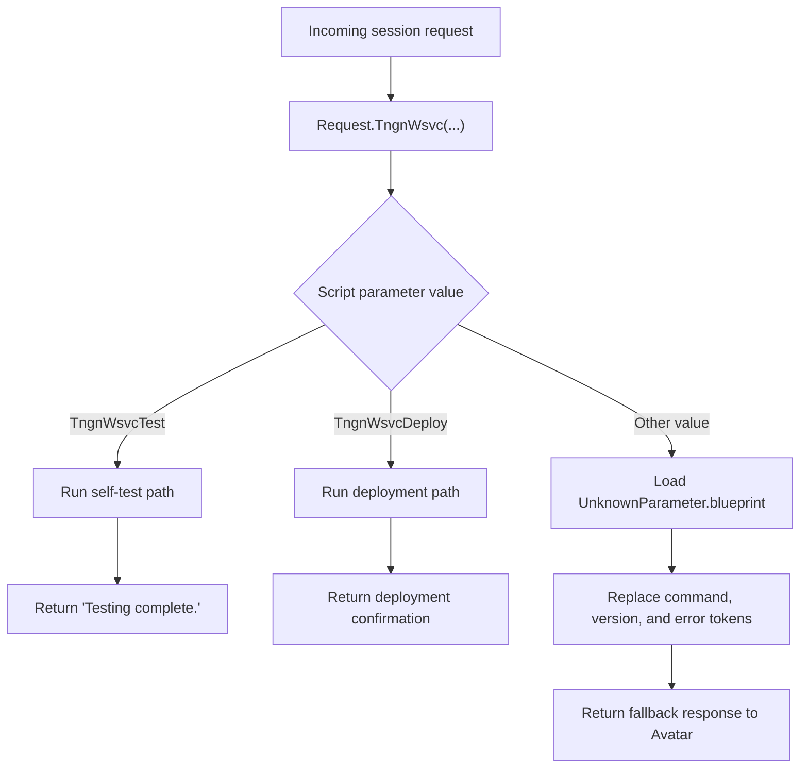

[Source Code Documentation](README.md) ❭ ns:TingenWebService.Core.Parse

  <picture>
    <source media="(prefers-color-scheme: dark)" srcset="../../../.github/logo/dark/256x173/SrcDoc.png">
    <source media="(prefers-color-scheme: light)" srcset="../../../.github/logo/light/256x173/SrcDoc.png">
    
  </picture>

  <h1>ns:TingenWebService.Core.Parse</h1>

***

> [!NOTE]
> See the [API documentation](https://spectrum-health-systems.github.io/Tingen-WebService/api/html/aca5c5da-a025-4fea-389e-5750c808254a.htm) for the source-level reference for this namespace.

***

## Overview

The `TingenWebService.Core.Parse` namespace contains the request parsing and dispatch logic used by the Tingen Web Service.

It interprets the active session's original script parameter, routes recognized commands to the correct handler, and builds a predictable fallback response when the command is not recognized.

## Types in this namespace

| Type | Purpose |
|---|---|
| `Request` | Parses inbound Tingen Web Service requests and dispatches them to the appropriate handler. |
| `NamespaceDoc` | Documentation-only type used to describe the namespace in generated help output. |

## Key responsibilities

### `Request`

`Request` is the dispatcher for the Tingen Web Service request pipeline.

It recognizes the session's original script parameter and supports three outcomes:

- `TngnWsvcTest` — runs the service self-test path
- `TngnWsvcDeploy` — runs the deployment path for the active Avatar system
- any other value — loads `UnknownParameter.blueprint` and returns a templated fallback response

This approach keeps request handling centralized and ensures unrecognized commands still return a controlled response instead of failing unexpectedly.

## Request flow

## How the namespace is used

A typical dispatch flow is:

1. The active `TngnWsvcSession` reaches the parsing stage.
2. `Request.TngnWsvc(...)` inspects the original script parameter.
3. The method selects the appropriate internal workflow or loads the fallback blueprint.
4. The final response is returned through the Avatar option object.
5. Trace logging records the routing decision for later diagnosis.

## Why this namespace matters

This namespace keeps inbound request handling predictable.

It helps the service:

- route known commands consistently
- return a stable error payload for unknown commands
- keep dispatch logic isolated from module-specific work
- preserve trace visibility for request flow analysis

## Related namespaces

- `TingenWebService.Core.Avatar` — Avatar payload and script-parameter context
- `TingenWebService.Core.Logger` — trace logging used during dispatch
- `TingenWebService.Core.Framework` — runtime path and folder support
- `TingenWebService.Core.TingenWsvcSession` — session state and bootstrap logic
- `TingenWebService.Module.TngnWsvc` — deployment and self-test support

 

***

[Source Code Documentation](README.md) ❭ ns:TingenWebService.Core.Parse

Last updated: 260709
