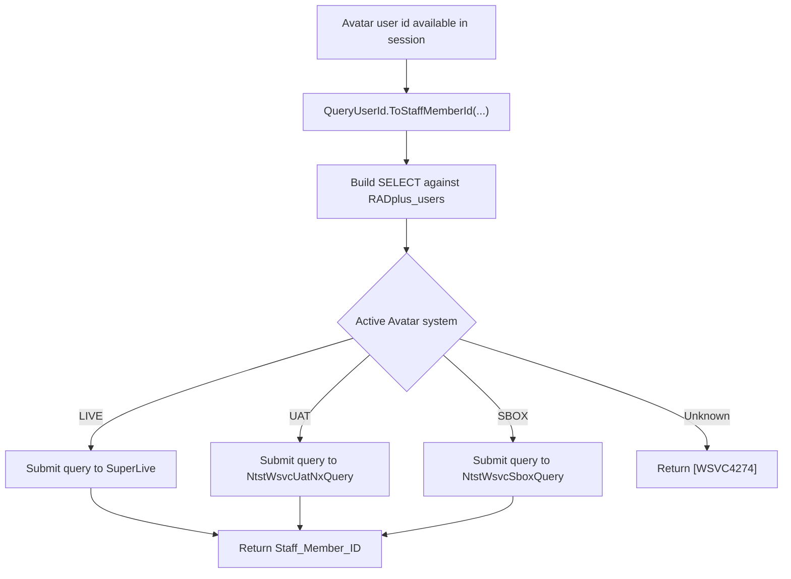

[Source Code Documentation](README.md) ❭ ns:TingenWebService.Core.Query

  <picture>
    <source media="(prefers-color-scheme: dark)" srcset="../../../.github/logo/dark/256x173/SrcDoc.png">
    <source media="(prefers-color-scheme: light)" srcset="../../../.github/logo/light/256x173/SrcDoc.png">
    
  </picture>

  <h1>ns:TingenWebService.Core.Query</h1>

***

> [!NOTE]
> See the [API documentation](https://spectrum-health-systems.github.io/Tingen-WebService/api/html/aca5c5da-a025-4fea-389e-5750c808254a.htm) for the source-level reference for this namespace.

***

## Overview

The `TingenWebService.Core.Query` namespace contains the database-query helpers used by the Tingen Web Service.

Its primary role is to resolve Avatar user identities against the correct Netsmart system and to support translation-file generation used by maintenance and lookup routines.

## Types in this namespace

| Type | Purpose |
|---|---|
| `QueryUserId` | Resolves Avatar user ids against the active Netsmart system and provides a translation-file helper hook. |
| `NamespaceDoc` | Documentation-only type used to describe the namespace in generated help output. |

## Key responsibilities

### `QueryUserId`

`QueryUserId` handles the query path used to map an Avatar user id to a Netsmart `Staff_Member_ID`.

It uses the active session's runtime configuration to choose the target system:

- `LIVE`
- `UAT`
- `SBOX`

The query is upper-cased before execution so it matches the expected Netsmart casing conventions. If the active system is not recognized, the method returns the error code `"[WSVC4274]"`.

The class also includes a translation-file helper hook used during maintenance workflows.

## Query flow

## Translation-file support

`QueryUserId` also provides a stub for generating translation files from a source user-id listing.

In the current service design, this supports daily maintenance by keeping cached Avatar-to-Tingen lookups aligned with the source database output.

## How the namespace is used

A typical query flow is:

1. The active session reaches a point where an Avatar user id must be resolved.
2. `QueryUserId.ToStaffMemberId(...)` builds the database query for the current Avatar system.
3. The result is returned as a Netsmart staff member identifier or an error code.
4. Maintenance routines may call `QueryUserId.CreateTranslationFile(...)` as part of translation-file refresh work.

## Why this namespace matters

This namespace keeps user-id resolution centralized and deployment-aware.

It helps the service:

- query the correct backend for the active environment
- keep user-id resolution consistent across modules
- support maintenance-driven translation refreshes
- preserve trace visibility for query execution

## Related namespaces

- `TingenWebService.Core.Maintenance` — daily refresh routines that use translation-file support
- `TingenWebService.Core.Translation` — runtime translation lookups for Avatar user data
- `TingenWebService.Core.Logger` — trace and debug logging for query execution
- `TingenWebService.Core.TingenWsvcSession` — session state and runtime configuration
- `TingenWebService.Core.Framework` — session framework and path support

 

***

[Source Code Documentation](README.md) ❭ ns:TingenWebService.Core.Query

Last updated: 260709
