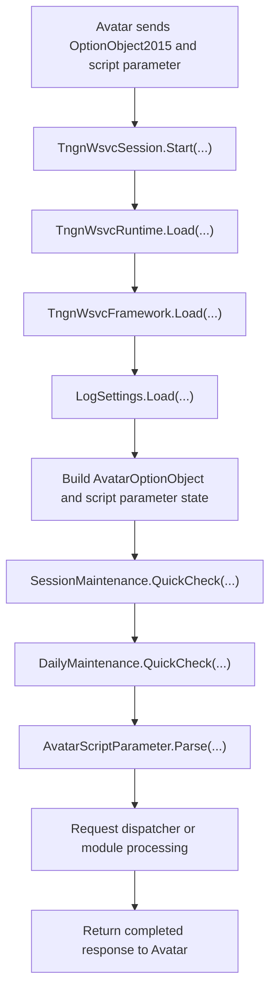

[Source Code Documentation](README.md) ❭ ns:TingenWebService.Core.TingenWsvcSession

  <picture>
    <source media="(prefers-color-scheme: dark)" srcset="../../../.github/logo/dark/256x173/SrcDoc.png">
    <source media="(prefers-color-scheme: light)" srcset="../../../.github/logo/light/256x173/SrcDoc.png">
    
  </picture>

  <h1>ns:TingenWebService.Core.TingenWsvcSession</h1>

***

> [!NOTE]
> See the API documentation for the source-level reference for this namespace.

***

## Overview

The `TingenWebService.Core.TingenWsvcSession` namespace contains the session objects that build and carry request-specific state for the Tingen Web Service.

It assembles the runtime values, framework paths, logging settings, Avatar payload, and script-parameter data needed to process a single request. It also includes session-level error handling so failures can be returned to Avatar in a consistent way.

## Types in this namespace

| Type | Purpose |
|---|---|
| `TngnWsvcRuntime` | Stores per-session runtime values such as date, time, version, mode, Avatar system, and service credentials. |
| `TngnWsvcSession` | Aggregates all state needed to process one Avatar request. |
| `TngnWsvcSessionError` | Provides hard-error handling helpers for returning unrecoverable failures to Avatar. |
| `NamespaceDoc` | Documentation-only type used to describe the namespace in generated help output. |

## Key responsibilities

### `TngnWsvcRuntime`

`TngnWsvcRuntime` captures the values that define the current request session.

It stores:

- session date and time
- service version
- operating mode
- target Avatar system
- Avatar user id
- Netsmart credentials
- running log content

This keeps runtime data consistent across the full request pipeline.

### `TngnWsvcSession`

`TngnWsvcSession` is the central session container.

It aggregates:

- `Runtime` for per-session values
- `Framework` for resolved folder paths
- `LogSetting` for trace and session log limits
- `OptObj` for Avatar `OptionObject` state
- `ScriptParameter` for the original request command

The session is created in one step and then passed through maintenance, parsing, dispatch, and response generation.

### `TngnWsvcSessionError`

`TngnWsvcSessionError` centralizes hard-error handling.

When an unrecoverable condition occurs, it:

- records the failure in the session running log
- keeps the original script parameter visible for diagnosis
- returns the error payload to Avatar through the standard option-object response path

This ensures failure handling stays consistent no matter where the error originates.

## Session flow

## How the namespace is used

A typical session flow is:

1. Avatar sends an `OptionObject2015` and script parameter.
2. `TngnWsvcSession.Start(...)` creates the session and loads all dependent state.
3. `TngnWsvcRuntime.Load(...)` captures the session timestamp and runtime values.
4. `TngnWsvcSession` stores the framework, logging, and Avatar payload objects.
5. Maintenance checks and request parsing run before dispatch.
6. If a hard failure occurs, `TngnWsvcSessionError` returns a controlled error response.

## Why this namespace matters

This namespace is the backbone of request processing.

It helps the service:

- keep all session state in one place
- avoid re-parsing runtime data
- preserve the original Avatar payload
- support predictable maintenance and dispatch behavior
- return hard errors in a consistent format

## Related namespaces

- `TingenWebService.Core.Avatar` — Avatar payload and script-parameter handling
- `TingenWebService.Core.Framework` — folder and runtime framework support
- `TingenWebService.Core.Logger` — trace, history, session, and error logging
- `TingenWebService.Core.Maintenance` — daily and session maintenance checks
- `TingenWebService.Core.Parse` — request parsing and dispatch logic

 

***

[Source Code Documentation](README.md) ❭ ns:TingenWebService.Core.TingenWsvcSession

Last updated: 260709
