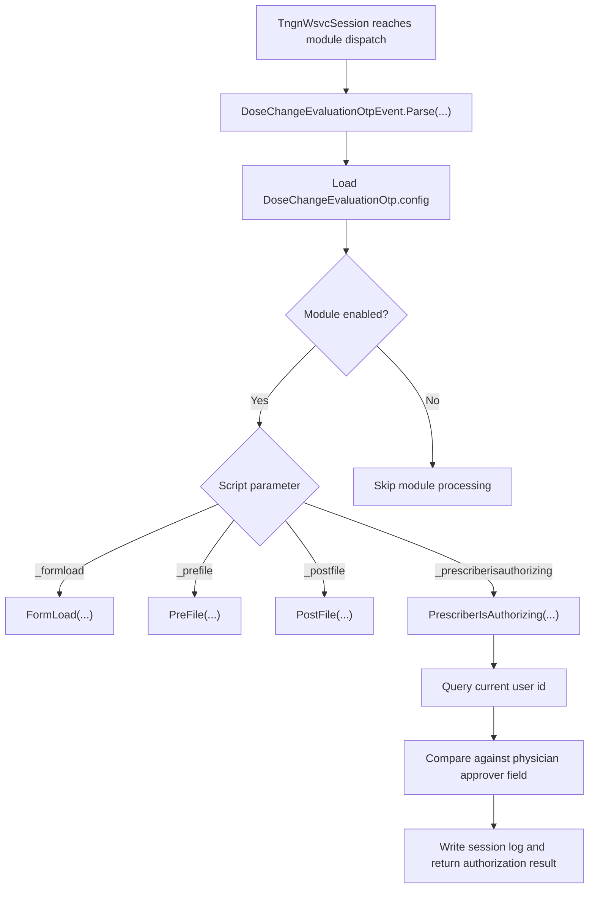

[Source Code Documentation](README.md) ❭ ns:TingenWebService.Module.DoseChangeEvaluationOtp

  <picture>
    <source media="(prefers-color-scheme: dark)" srcset="../../../.github/logo/dark/256x173/SrcDoc.png">
    <source media="(prefers-color-scheme: light)" srcset="../../../.github/logo/light/256x173/SrcDoc.png">
    
  </picture>

  <h1>ns:TingenWebService.Module.DoseChangeEvaluationOtp</h1>

***

> [!NOTE]
> See the [API documentation](https://spectrum-health-systems.github.io/Tingen-WebService/api/html/6e9d56b6-ab35-66a3-0de0-fede1aeacf75.htm) for the source-level reference for this namespace.

***

## Overview

The `TingenWebService.Module.DoseChangeEvaluationOtp` namespace contains the module logic used to evaluate dose change authorization for the current Tingen Web Service session.

It loads module configuration, routes script events, checks the current prescriber against the authorizing provider, and writes session log entries that support the authorization decision.

## Types in this namespace

| Type | Purpose |
|---|---|
| `DoseChangeEvaluationOtpConfig` | Stores module configuration such as allowlists, field identifiers, and user-facing authorization messages. |
| `DoseChangeEvaluationOtpEvent` | Routes module events and performs the authorization checks for supported script parameters. |
| `DoseChangeEvaluationOtpQuery` | Documentation placeholder for module query-related logic. |
| `DoseChangeEvaluationOtpLogic` | Documentation placeholder for supporting module logic. |
| `NamespaceDoc` | Documentation-only type used to describe the namespace in generated help output. |

## Key responsibilities

### `DoseChangeEvaluationOtpConfig`

`DoseChangeEvaluationOtpConfig` defines the module's runtime settings.

It stores:

- operating mode
- allowlist, review list, and denylist entries
- field identifiers used during authorization checks
- the message and error code returned when authorization is denied

If the configuration file does not exist, a default file is created before the module is loaded.

### `DoseChangeEvaluationOtpEvent`

`DoseChangeEvaluationOtpEvent` is the main entry point for module execution.

It loads the module configuration and routes supported script parameters:

- `_formload`
- `_prefile`
- `_postfile`
- `_prescriberisauthorizing`

The `PrescriberIsAuthorizing(...)` path compares the current session's user identity against the physician approver value stored on the Avatar option object. When the values match, the module can allow the authorization workflow to proceed.

## Module flow

## How the namespace is used

A typical module flow is:

1. The active `TngnWsvcSession` is dispatched to the module.
2. `DoseChangeEvaluationOtpEvent.Parse(...)` loads the module configuration.
3. The module selects the handler that matches the current script parameter.
4. `PrescriberIsAuthorizing(...)` compares the current user with the authorizing provider value.
5. Session and debug logs capture the decision path for later review.

## Why this namespace matters

This namespace keeps dose-change authorization rules isolated from the rest of the service.

It helps the application:

- load module settings from a dedicated configuration file
- evaluate authorization using consistent rules
- keep event handling separated by script phase
- record the decision path in session logs

## Related namespaces

- `TingenWebService.Core.Avatar` — Avatar option-object and script-parameter context
- `TingenWebService.Core.Query` — user-id resolution used during authorization checks
- `TingenWebService.Core.Logger` — trace, debug, and session logging
- `TingenWebService.Core.TingenWsvcSession` — runtime session state and bootstrap logic
- `TingenWebService.Core.Catalog` — message and log catalog helpers

 

***

[Source Code Documentation](README.md) ❭ ns:TingenWebService.Module.DoseChangeEvaluationOtp

Last updated: 260709
