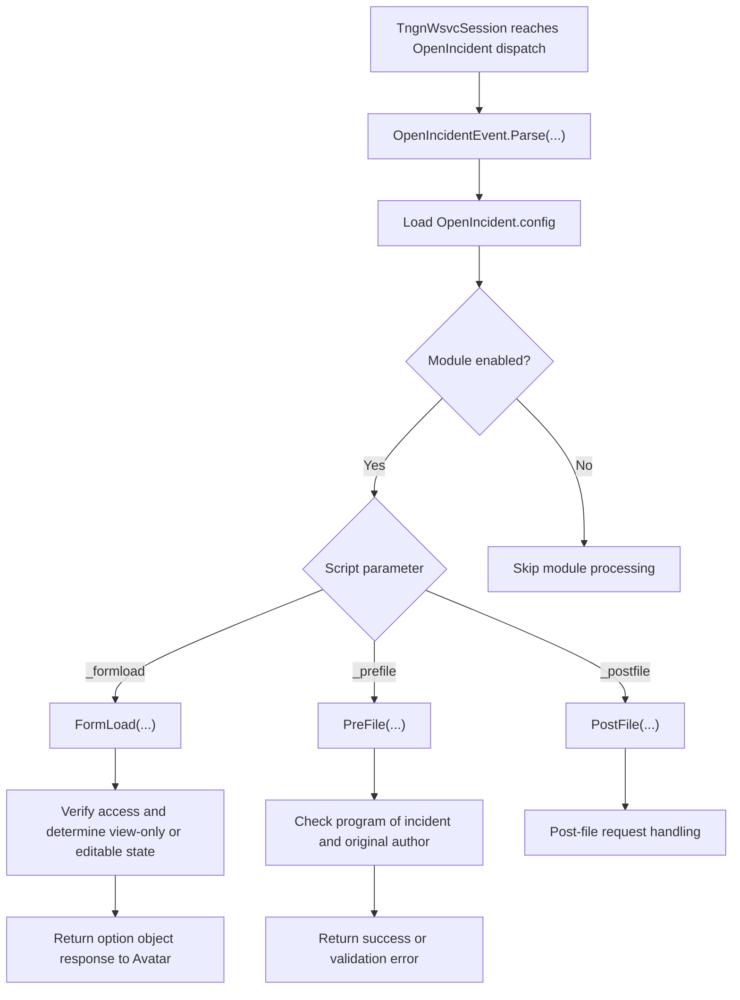

[Source Code Documentation](README.md) ❭ ns:TingenWebService.Module.OpenIncident

  <picture>
    <source media="(prefers-color-scheme: dark)" srcset="../../../.github/logo/dark/256x173/SrcDoc.png">
    <source media="(prefers-color-scheme: light)" srcset="../../../.github/logo/light/256x173/SrcDoc.png">
    
  </picture>

  <h1>ns:TingenWebService.Module.OpenIncident</h1>

***

> [!NOTE]
> See the [API documentation](https://spectrum-health-systems.github.io/Tingen-WebService/api/html/6e9d56b6-ab35-66a3-0de0-fede1aeacf75.htm) for the source-level reference for this namespace.

***

## Overview

The `TingenWebService.Module.OpenIncident` namespace contains the module logic used to open, validate, and submit incident activity during the Avatar request lifecycle.

It loads module configuration, verifies access based on user roles and translation data, and applies request-phase rules so incident forms are handled consistently.

## Types in this namespace

| Type | Purpose |
|---|---|
| `OpenIncidentConfig` | Stores module settings, field identifiers, role lists, and user-facing error messages. |
| `OpenIncidentEvent` | Routes the module's form-load, pre-file, and post-file event handling. |
| `OpenIncidentLogic` | Contains business logic for access checks and author validation. |
| `OpenIncidentRequest` | Contains request-related handlers for module phases such as post-file processing. |
| `NamespaceDoc` | Documentation-only type used to describe the namespace in generated help output. |

## Key responsibilities

### `OpenIncidentConfig`

`OpenIncidentConfig` defines the runtime settings for the module.

It stores:

- operating mode
- whitelist, greylist, and blacklist entries
- authorized user roles
- Avatar field identifiers used by the workflow
- messages and error codes returned for validation failures

If the configuration file is missing, a default one is created before it is loaded.

### `OpenIncidentEvent`

`OpenIncidentEvent` is the module entry point.

It loads the configuration and routes the current script parameter to the matching handler:

- `_formload`
- `_prefile`
- `_postfile`

The form-load and pre-file stages determine whether the current user may view or submit the incident, while the post-file stage is reserved for later processing.

### `OpenIncidentLogic`

`OpenIncidentLogic` contains the authorization checks used by the module.

It determines whether the current user:

- is the original author of the incident
- belongs to an authorized user role
- matches the translated user description for the session

These checks decide whether the incident can be opened, viewed only, or submitted.

## Module flow

## How the namespace is used

A typical module flow is:

1. The active `TngnWsvcSession` is dispatched to the module.
2. `OpenIncidentEvent.Parse(...)` loads the module configuration.
3. The matching event handler evaluates the current incident and request state.
4. `OpenIncidentLogic` performs role, author, and translation-table checks.
5. The module returns the appropriate Avatar response or validation message.

## Why this namespace matters

This namespace keeps incident-processing rules isolated from the core request pipeline.

It helps the application:

- validate who may view or submit an incident
- enforce author and role-based access rules
- keep incident configuration in one place
- preserve diagnostic logging for authorization decisions

## Related namespaces

- `TingenWebService.Core.Avatar` — Avatar option-object and script-parameter context
- `TingenWebService.Core.Query` — user-id resolution used during author checks
- `TingenWebService.Core.Translation` — translation-table lookups for user identity
- `TingenWebService.Core.Logger` — trace, debug, and session logging
- `TingenWebService.Core.TingenWsvcSession` — session state and bootstrap logic

 

***

[Source Code Documentation](README.md) ❭ ns:TingenWebService.Module.OpenIncident

Last updated: 260709
