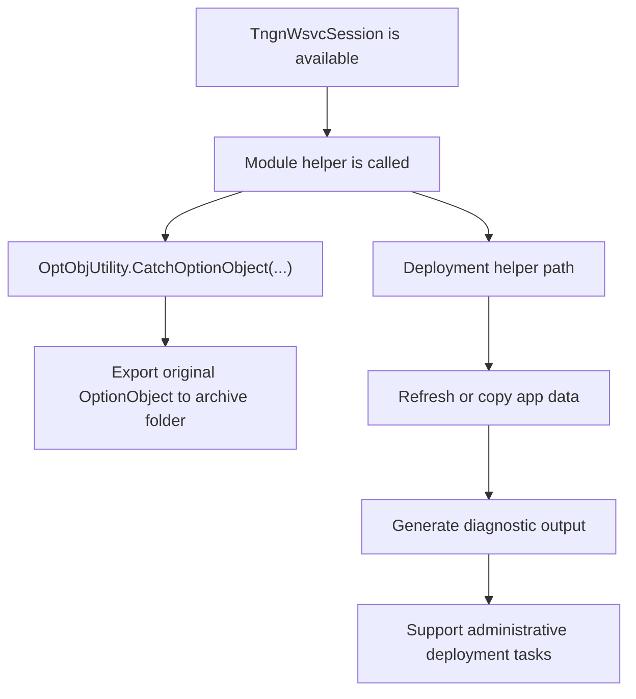

[Source Code Documentation](README.md) ❭ ns:TingenWebService.Module.TngnWsvc

  <picture>
    <source media="(prefers-color-scheme: dark)" srcset="../../../.github/logo/dark/256x173/SrcDoc.png">
    <source media="(prefers-color-scheme: light)" srcset="../../../.github/logo/light/256x173/SrcDoc.png">
    
  </picture>

  <h1>ns:TingenWebService.Module.TngnWsvc</h1>

***

> [!NOTE]
> See the [API documentation](https://spectrum-health-systems.github.io/Tingen-WebService/api/html/26b0dd8a-5bfb-fd93-8332-1f0df6d36657.htm) for the source-level reference for this namespace.

***

## Overview

The `TingenWebService.Module.TngnWsvc` namespace contains shared module support used by Tingen Web Service features.

It provides lightweight helpers for option-object handling and administrative deployment-related tasks that can be reused across module code.

## Types in this namespace

| Type | Purpose |
|---|---|
| `Deployer` | Holds administrative deployment helpers and prototype deployment routines. |
| `OptObjUtility` | Provides option-object utility helpers used by module code. |
| `NamespaceDoc` | Documentation-only type used to describe the namespace in generated help output. |

## Key responsibilities

### `OptObjUtility`

`OptObjUtility` is the active helper in this namespace.

It exports the original option object from the current session to the configured export folder so the payload can be inspected or archived outside the request pipeline.

This is useful when a module needs to capture the inbound Avatar data without altering the working copy.

### `Deployer`

`Deployer` is currently a placeholder for administrative deployment functionality.

The file shows the intended shape of deployment support, including:

- copying application data
- refreshing server-side content
- generating diagnostic logs
- performing test and regression-style checks

Most of the implementation is commented out, but the namespace is clearly reserved for future deployment-oriented work.

## Module support flow

## How the namespace is used

A typical support flow is:

1. A module or admin routine receives the active `TngnWsvcSession`.
2. `OptObjUtility.CatchOptionObject(...)` exports the original option object when capture is needed.
3. `Deployer`-related routines can be used for deployment-oriented maintenance work.
4. Logging records the action in the current session trace.

## Why this namespace matters

This namespace keeps reusable module support in one place.

It helps the application:

- preserve the original Avatar payload for inspection
- support future administrative deployment features
- keep module-specific utility code isolated from business logic
- maintain trace visibility for support operations

## Related namespaces

- `TingenWebService.Core.Avatar` — Avatar payload handling and option-object support
- `TingenWebService.Core.Logger` — trace logging used by helper methods
- `TingenWebService.Core.TingenWsvcSession` — session state and folder context
- `TingenWebService.Core.Framework` — folder structures used by export and deployment work
- `TingenWebService.Module.OpenIncident` — module logic that may use shared support helpers

 

***

[Source Code Documentation](README.md) ❭ ns:TingenWebService.Module.TngnWsvc

Last updated: 260709
