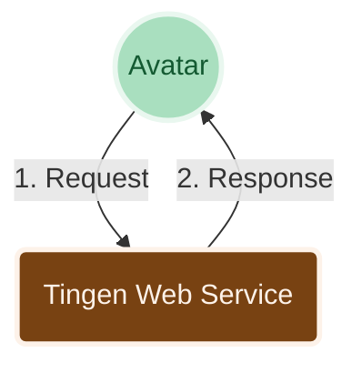
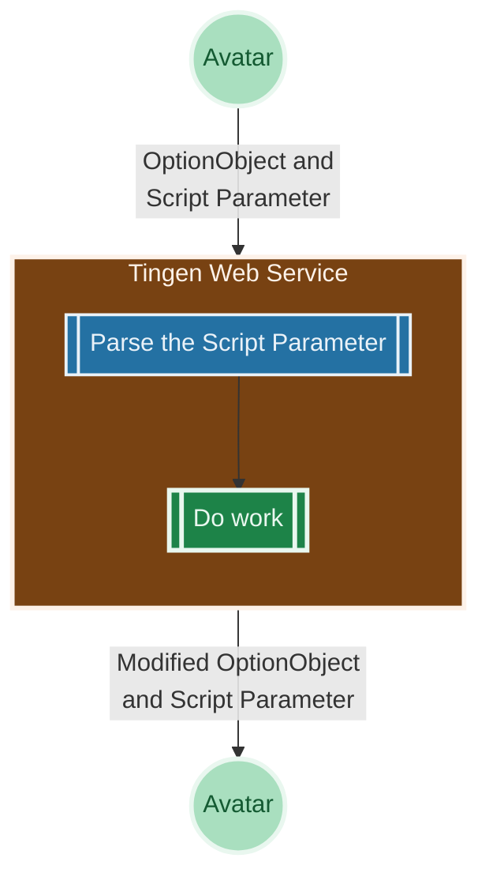
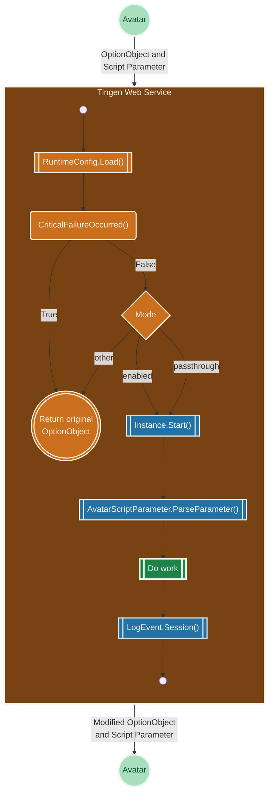

[Manual](README.md) ❭ About the Tingen Web Service

  <picture>
    <source media="(prefers-color-scheme: dark)" srcset="../../.github/logo/dark/256x173/Man.png">
    <source media="(prefers-color-scheme: light)" srcset="../../.github/logo/light/256x173/Man.png">
    
  </picture>

   
   

  

<h1>About the Tingen Web Service</h1>

| CONTENTS |
|:---------|
| [An introduction](#an-introduction) |
| [How it works](#how-it-works) |
| &nbsp;&nbsp;&nbsp;&nbsp;[The 50,000 foot view](#the-50000-foot-view)  |
| &nbsp;&nbsp;&nbsp;&nbsp;[A closer look](#a-closer-look)               |
| &nbsp;&nbsp;&nbsp;&nbsp;[An *even closer* look](#an-even-closer-look) |

***

# An introduction

<!-- This text should be straight from the repository README.md, and should be updated when the README.md is updated. -->
Netsmart's [AvatarNX™ EHR](https://www.ntst.com/Solutions-and-Services/Offerings/myAvatar) is a behavioral health Electronic Health Records application that offers a recovery-focused suite of solutions that leverage real-time analytics and clinical decision support to drive value-based care.

While AvatarNX™ is a robust platform, it isn't perfect. The good news is that you can extend AvatarNX™ functionality via [Netsmart's Web Services](URL), and/or custom web services that are written by other AvatarNX™ users.

The **Tingen Web Service** is one such custom web service which includes various tools and utilities for AvatarNX™ that aren't included in the official release, and provides a solid foundation for building additional functionality quickly and efficiently.

# How it works

Here are some cool looking diagrams that will help explain how the Tingen Web Service works.

## The 50,000 foot view

A very high level overview of how the Tingen Web Service works:

1. Avatar sends an [`OptionObject`](../glossary/OptionObject.md) and a [`ScriptParameter`](../glossary/ScriptParameter.md) to the Tingen Web Service
2. The Tingen Web Service processes the request and returns a modified `OptionObject` back to Avatar

## A closer look

If you want to understand the Tingen Web Service a little better, here's a more detailed overview of how it works:

1. Avatar sends an [`OptionObject`](../glossary/OptionObject.md) and a [`ScriptParameter`](../glossary/ScriptParameter.md) to the Tingen Web Service
2. The Tingen Web Service uses the `ScriptParameter` to determine what work needs to be done
3. The Tingen Web Service does the work, which may include modifying the `OptionObject`
4. The Tingen Web Service returns the modified `OptionObject` back to Avatar

## An *even closer* look

Oh boy! This is going to be a doozy! Let's break down the Tingen Web Service's internal workings in excruciating detail.

NEXT: [Requirements](Requirements.md)

 

***

[Manual](README.md) ❭ About the Tingen Web Service

Last updated: 260618
